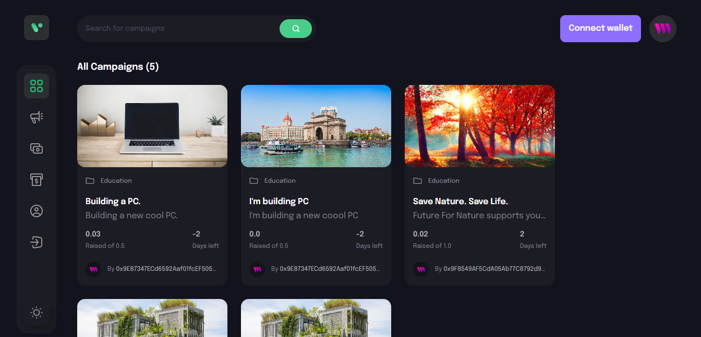
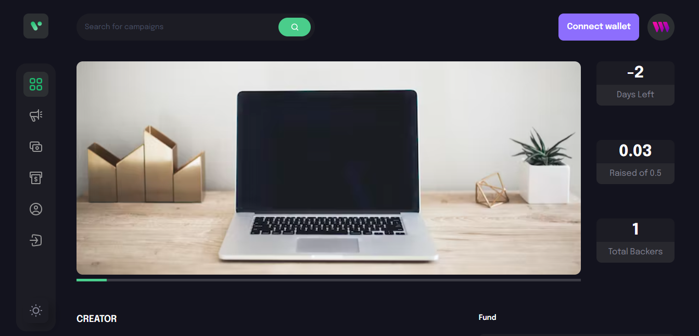

# Crowdfunding Project

This project is built with React.js and Web3 technology in action. You can create your own campaign with just a few clicks and you're done OR you can fund a campaign of your choice from our campaigns listings. This project is just for learning purpose of how web3 technology works behind the scenes. The web3 backend is already hosted on the [ThirdWeb](https://thirdweb.com/) platform which makes it easy to deploy a smart contract on the blockchain network.

## Authors

-  [@ayush-dedhia25](https://www.github.com/ayush-dedhia25)

## Environment Variables

To run this project, you will need to add the following environment variables to your .env file

`VITE_CONTRACT_ADDRESS=<Your_deployed_contract_address>`

`PRIVATE_KEY=<Smart_contract_private_key>`

## Installation

Install crowdfunding-app with npm

```bash
  npm install crowdfunding-app
  cd my-project
```

## Screenshots



